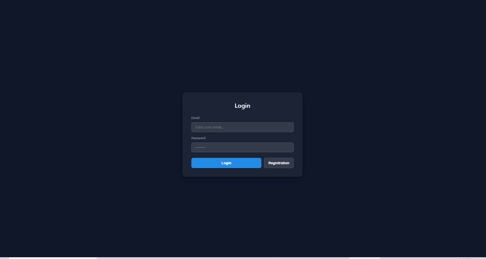
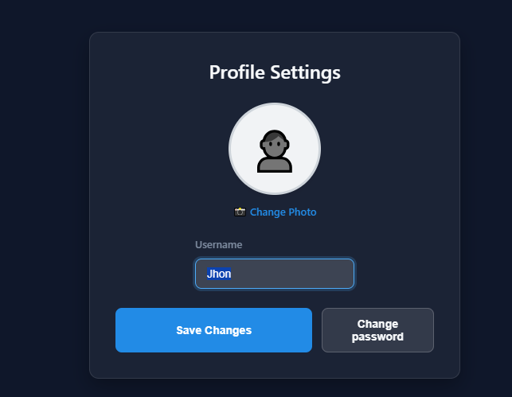
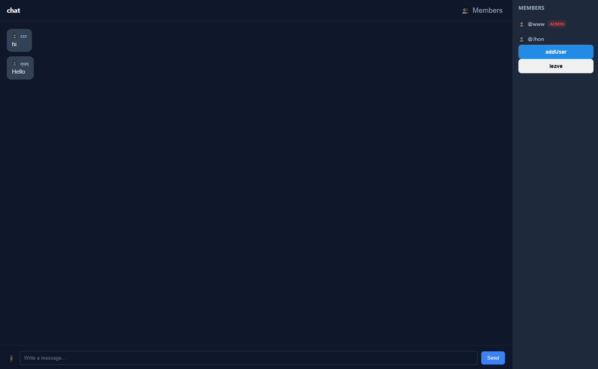

# Real-time Messenger

Messanger on Node.js + React + Socket.io with rooms, private chats, authorization and real-time update.

## Demo

## Features
- Registration/ Login (JWT + httpOnly cookies)
- Email verification
- Real-time messages (Socket.io)
- Group and private chats
- Online-status
- Admin role
- Blocking users
- Avatar and files upload
- Changes of profile and main rooms

## Tech Stack
Frontend: React, Socket.io-client  
Backend: Node.js, Express, Socket.io  
Database: MongoDB  
Auth: JWT, Argon2, cookies

## Screenshots
| Chats | Profile |
|------|---------|
|  |  |
|  |

## Getting Started
### Requirements
- Node.js
- MongoDB

### Download
`bash
git clone https://github.com/твой-логин/твой-репо.git
cd your-repo
npm install

### Start
# backend
node server.mjs

# frontend
npm run dev
